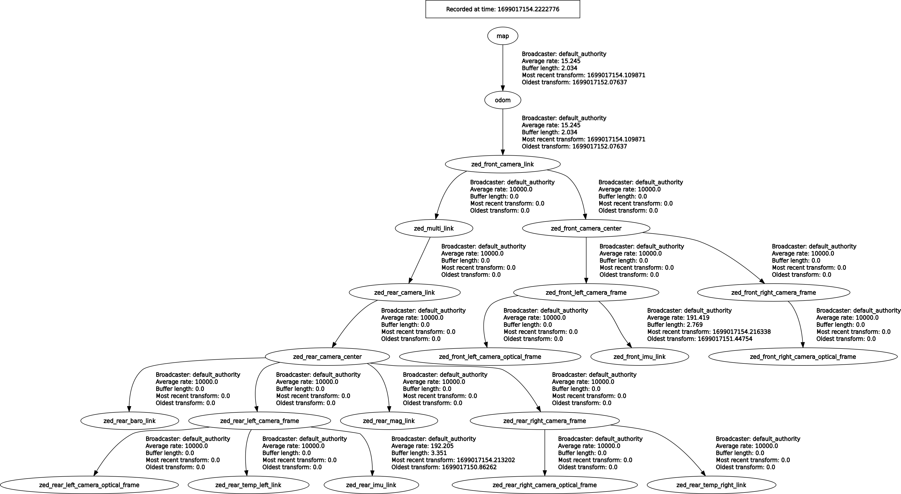

# Multi camera tutorial

In this tutorial you will learn how to create a multi-camera configuration with ZED devices.

For a multi-camera configuration it is important to correctly identify each camera in the system by
using its serial number and precisely set the position and the orientation of each of them with respect to a reference point.

## The launch file explained

The example launch file `zed_multi_camera.launch.py` allows to dynamically configure a robotics system equipped with multiple different models of ZED cameras.

The launch file starts a Robot State Publisher node that defines the position and orientation of each camera in the multi-camera system, a Robot State Publisher node for each camera that broadcast all the static frames of the camera, and a ZED node for each camera.

The number of ZED nodes to start is infered by the size of the parameters passed to the launch file from the command line.

All the ZED nodes are loaded in the same ROS 2 container using [Composition](https://docs.ros.org/en/humble/Concepts/Intermediate/About-Composition.html#composition). It is possible to load other ROS 2 components in the same container to leverage zero copy Intra-Process Communication (IPC).

You can retrieve the name of the container and check the components that are running in the same process by using the command 

```bash
ros2 component list
```

for example:

```bash
$ ros2 component list
/zed_multi/zed_multi_container
  1  /zed_multi/zedx_front
  2  /zed_multi/zedx_rear
```

> :pushpin: **Note**: All the nodes run in the same namespace `zed_multi`.

### Launch parameters

All the parameter arrays must have the same size:

* `cam_names`: {REQUIRED} An array containing the name of the cameras, e.g. `'[zed_front,zed_back]'`. **Note:** It is important that all the cameras have a different name to correctly distinguish them.
* `cam_models`: {REQUIRED} An array containing the model of the cameras, e.g. `'[zed2i,zed2]'`
* `cam_serials`: An array containing the serial number of the cameras, e.g. `[3001234,2001234]`
* `cam_ids`: An array containing the ID number of the cameras, e.g. `[0,1]`
* `disable_tf`: Only the first camera is configured to broadcast the TF `map` -> `odom` -> `camera_link` to avoid TF conflicts. The TF broadcasting can be disabled by setting this parameter to `false`. This is required if an external Kalman filter that fuses different odometry sources is used.

> :pushpin: **Note**: One of `cam_serials` or `cam_ids` argument is required to uniquely identify the cameras of the system.

## Run the example

Launch the dual camera nodes by using the following command

```bash
ros2 launch zed_multi_camera zed_multi_camera.launch.py cam_names:='[zed_front,zed_back]' cam_models:='[zed2i,zed2]' cam_serials:='[31234567,21234567]'
```

**Info:** To retrieve the serial number of each connected camera you can use the command `$ ZED_Explorer --all`.

**Note:** The parameters `cam_models` and `cam_serials` must be modified according to the configuration of your system.

Example with serial numbers:

```bash
ros2 launch zed_multi_camera zed_multi_camera.launch.py cam_names:='[zed_front,zed_back]' cam_models:='[<front_camera_model>,<rear_camera_model>]' cam_serials:='[<front_camera_serial>,<rear_camera_serial>]'
```

Example with ID numbers:

```bash
ros2 launch zed_multi_camera zed_multi_camera.launch.py cam_names:='[zed_front,zed_back]' cam_models:='[<front_camera_model>,<rear_camera_model>]' cam_ids:='[<front_camera_id>,<rear_camera_id>]'
```

> :pushpin: **Note**: For multi-GMSL2 camera setups, it's advisable to use camera IDs rather than Serial Numbers. Each camera ID linked to a GMSL2 wire remains consistent during reboots, unlike USB3 cameras, which may change.

### The Multi-Camera URDF

It is important to create a URDF that defines the position of all the cameras with respect to a reference link.

We provide an example in 'urdf/zed_multi.urdf.xacro'.

The URDF is created by using the 'xacro' tool.

First of all all reference links are created:

```xml
  <link name="$(arg multi_link)" />
  <link name="$(arg camera_name_0)_camera_link" />
  <link name="$(arg camera_name_1)_camera_link" />
```

The name of the reference link is contained in the xacro argument `multi_link`, the default value is `zed_multi_link`.
A "virtual" link `camera_link` for each camera must be defined to correctly connect the URDF of each camera to the reference link.

Next, a joint to connect the reference link to the main link of each camera is created:

```xml
  <joint name="$(arg camera_name_0)_camera_joint" type="fixed">
      <parent link="$(arg camera_name_0)_camera_link"/>
      <child link="$(arg multi_link)"/>
      <origin xyz="0.06 0.0 0.0" rpy="0 0 0" />
  </joint>

  <joint name="$(arg camera_name_1)_camera_joint" type="fixed">
      <parent link="$(arg multi_link)"/>
      <child link="$(arg camera_name_1)_camera_link"/>
      <origin xyz="-0.06 0.0 0.0" rpy="0 0 ${M_PI}" />
  </joint>
```

The name of the joint is created from the variable `camera_name_x` that identifies the name of each camera.
A position and orientation must be provided for each camera with respect to the main link:
`<origin xyz="x y z" rpy="r p y" />` 
the position is in meters, the orientation in radians.

**Important:** The first joint has `parent link` and `child link` inverted with respect to all the other joints. This is required because
the first camera is the reference for visual odometry processing and in ROS a joint cannot have two parents.

The following image displays the TF tree generated for the dual camera configuration of this tutorial:


